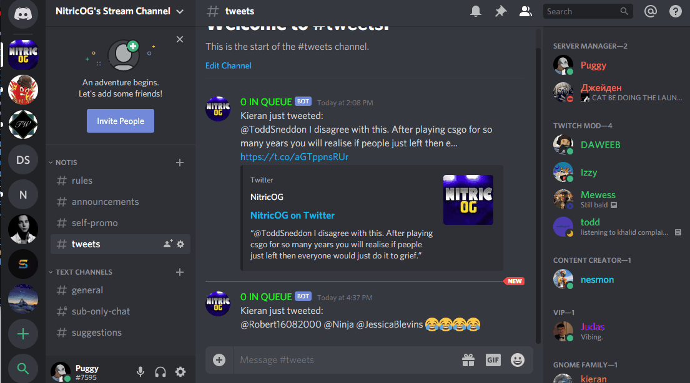

# Discord Socials Bot

This bot will take any conents from a users social media then post it to a discord channel when the user posts something to their social media.

## Getting Started


### Prerequisites

You will need a Discord Developer Account with an application with a bot created in the application [Discord Developer Portal](https://discordapp.com/developers).  
Your discord software will need to be in developer mode too so that you can get the ID's for the channel you want to post into.



If you plan on grabbing a users tweets will need to have a Twitter Developer account with an App created [Twitter Developer Portal](https://developer.twitter.com/en).  
Ensure that you have your Consumer API key, API secret key, Access token and access token secret. These can all be found in [Twitter Devloper Apps](https://developer.twitter.com/en/apps/) and in your app and under the tab 'Keys and Tokens'.

### Installing

Firstly you will need to go into config.json and enter your discord bots token into the "token" field like follows:

```
"token": "Njk5NzsdAYwODEzNTQyODk12NzI0.XpWK0A.G7VK_hVq_yqkasdPjtsEsmTAsAwo",
```

Get the id of the discord channel that you want the bot to post into by doing as follows:


Then set the value of "disc_channel" field in config.json by pasting the ID that has been copied to your clipboard.

```
"disc_channel": "699579383597236306",
```

Then do the same but for the discord user that you are getting the tweets from, by copying their ID with the same method as above but right clicking on a discord user.

```
"disc_id": "651130233596149770",
```

Then if you want the users twitter to be posted into the discord enter the users twitter ID into config.json, to get the Twitter ID use the following: [TweeterID](https://tweeterid.com/).

It is important that there are no speech marks either side of the ID when you add it to config.json:

```
"twitter_id": 2498447404,
```

Support for instagram is coming at at a later date, so leave the instagram_id field as null for now.  

Your config.json should now look like something as follows:

```
{
	"token": "Njk5NzsdAYwODEzNTQyODk12NzI0.XpWK0A.G7VK_hVq_yqkasdPjtsEsmTAsAwo",
	"disc_channel": "699579383597236306",
	"disc_id": "651130233596149770",
	"twitter_id": 2498447404,
	"instagram_id": null
}
```

If you want the bot to add tweets then go into twitter_config.json and enter your keys and tokens that can be found at [Twitter Developer Apps](https://developer.twitter.com/en/apps/).  
It will look something like the following:
```
{
	"consumer_key": "L123Wqo12QPH1nASDFASCiZjwZXVCBpk",
	"consumer_secret": "HEJmvMaf4ASC8ashd3vPUDBZXhlwqoAkbfarnUFu5",
	"access_token": "112123165477380736-COsisjRVasdzASasqzCKI1lZMqasASYUIAasdzSHB",
	"access_token_secret" : "XdUXaasdaffgdgxi0UL1Jasdepb1231RFNtAyCyKexkCzOcn4A"
}

```

Now you should be able to run the bot by simply entering
```node main.js``` into the Command Prompt.


